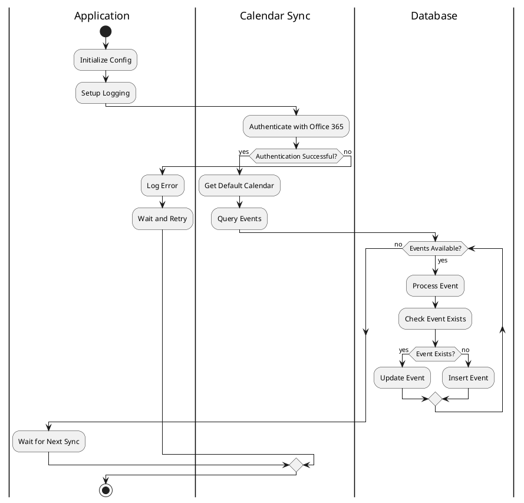

# Outlook Calendar SQL Sync

A Python application that syncs Outlook calendar events from an Office 365 account to a SQL Server database.

## Features

- Authenticates with Office 365 using client credentials
- Syncs calendar events to SQL Server database
- Handles event updates and deletions
- Supports querying events by date range and category
- Handles recurring events with a 5-year range (past and future)
- Manages event categories with many-to-many relationships
- Configurable sync interval
- Comprehensive logging with rotation
- Unit tests for core functionality
- Automatic database table creation

## Prerequisites

- Python 3.8 or higher
- SQL Server instance
- Office 365 account with appropriate permissions
- ODBC Driver 18 for SQL Server

## Getting Office 365 Credentials

To obtain the `CLIENT_ID` and `CLIENT_SECRET` for Office 365 authentication:

1. Go to the [Azure Portal](https://portal.azure.com)
2. Sign in with your Office 365 administrator account
3. Navigate to "Azure Active Directory" > "App registrations"
4. Click "New registration"
5. Fill in the registration form:
   - Name: "Calendar Sync App" (or your preferred name)
   - Supported account types: "Accounts in this organizational directory only"
   - Redirect URI: Leave blank (we're using client credentials)
6. Click "Register"
7. After registration, note down the following:
   - Application (client) ID: This is your `CLIENT_ID`
   - Directory (tenant) ID: You might need this for troubleshooting

8. Create a client secret:
   - Go to "Certificates & secrets"
   - Click "New client secret"
   - Add a description and choose an expiration
   - Click "Add"
   - **IMPORTANT**: Copy the secret value immediately - this is your `CLIENT_SECRET`
     You won't be able to see it again after leaving the page

9. Configure API permissions:
   - Go to "API permissions"
   - Click "Add a permission"
   - Choose "Microsoft Graph"
   - Select "Application permissions"
   - Search for and select:
     - `Calendars.Read`: Allows the application to read calendar events in the organization.
     - `Calendars.Read.All`: Allows the application to read all calendar events in the organization.
   - Click "Add permissions"
   - Click "Grant admin consent" and confirm. This step is crucial for the application to access the calendar data.

These credentials will be used in your `.env` file.

## Installation

1. Clone the repository:
```bash
git clone <repository-url>
cd outlook-calendar-sync
```

2. Create a virtual environment and activate it:
```bash
python -m venv venv
source venv/bin/activate  # On Windows: venv\Scripts\activate
```

3. Install dependencies:
```bash
pip install -r requirements.txt
```

4. Create a `.env` file based on `.env.example`:
```bash
cp .env.example .env
```

5. Update the `.env` file with your credentials:
```env
CLIENT_ID=your_client_id
CLIENT_SECRET=your_client_secret
DB_SERVER=your_server
DB_NAME=your_database
DB_USER=your_user
DB_PASSWORD=your_password
LOG_LEVEL=INFO
SYNC_INTERVAL_MINUTES=15
LOG_RETENTION_DAYS=7
```

## Usage

1. Start the sync process:
```bash
python main.py
```

The application will:
- Create the required database table if it doesn't exist
- Perform an initial sync of calendar events
- Schedule periodic syncs based on the configured interval
- Log activities to the `logs` directory

## Testing

Run the test suite:
```bash
pytest
```

## Project Structure

```
.
├── README.md
├── requirements.txt
├── .env.example
├── schema.sql
├── main.py
├── config.py
├── database.py
├── calendar_sync.py
└── test_calendar_sync.py
```

## Workflow Diagram



## Error Handling

The application includes comprehensive error handling for:
- Authentication failures
- API rate limits
- Database connection issues
- Event processing errors

Errors are logged with appropriate severity levels and the application will attempt to recover when possible.

## Extending the Application

To add new features:

1. Calendar Operations:
   - Extend the `CalendarSync` class with new methods
   - Update the database schema if needed

2. Database Operations:
   - Add new methods to the `DatabaseManager` class
   - Create new SQL queries as needed

3. Configuration:
   - Add new settings to `.env` file
   - Update `config.py` to handle new settings

## Troubleshooting

1. Authentication Issues:
   - Verify client credentials in `.env`
   - Check Office 365 permissions
   - Review authentication logs

2. Database Issues:
   - Verify connection string
   - Check SQL Server credentials
   - Ensure ODBC driver is installed

3. Sync Issues:
   - Check log files for errors
   - Verify network connectivity
   - Review API rate limits

## License

This project is licensed under the MIT License - see the LICENSE file for details.

## Contributing

1. Fork the repository
2. Create a feature branch
3. Commit your changes
4. Push to the branch
5. Create a Pull Request 

## Database Schema

The application uses the following database tables:

1. `calendar_events`: Stores the main event data
   - Event details from Outlook
   - Timestamps and sync information
   - Links to categories

2. `calendar_categories`: Stores event categories
   - Category name
   - Category color
   - Other metadata

3. `event_categories`: Junction table for many-to-many relationship
   - Links events to their categories
   - Enables efficient category-based querying 